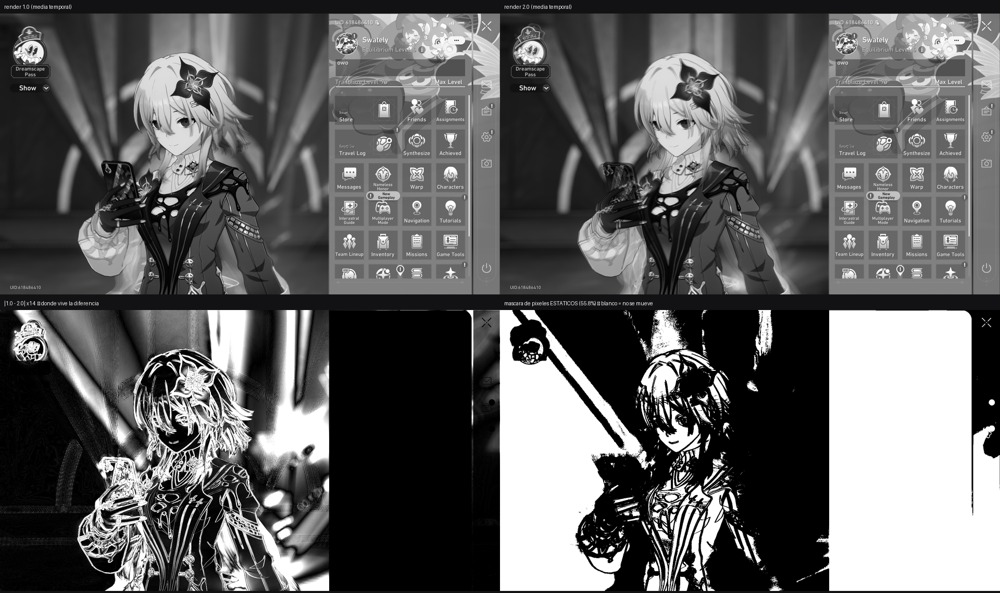

# A0 — can a real game supply AA ground truth? Measured: not this way.

**Date** 2026-09-07 · **Rig** RTX 4090 · **Content** Honkai: Star Rail, pause menu, borderless
1920x1080, DLAA off · **Capture** the FG's own `--qdump` via `--window-pid`, 24 triples at render
scale 1.0 and 13 at 2.0, the operator changing only that setting between them.

## What was being decided

Day 0 of the AA route (`docs/research/LEARNED_AA.md`): does a route exist to paired
aliased/anti-aliased frames from a REAL game, or is the synthetic corpus
([A1](../../tools/aa_truth/aa_zoo.py)) the only ground truth available? The plan proposed two
candidates and warned about both.

## The DSR candidate died before it was measured, on a structural conflict

DSR was enabled and DISPLAY1 duly offered 2048x1536 through 7680x4320. But the game runs
**borderless** (`WS_POPUP`, no caption, rect 0,0 1920x1080), and DSR resolutions are offered to
**exclusive fullscreen**. That matters more than it sounds, because PhyriadFG's own taxonomy already
rules exclusive fullscreen out: `compat_reason.hpp` reason 1, `EXCLUSIVE_FULLSCREEN` — *"the target
presents EXCLUSIVE-FULLSCREEN — WGC/DD capture is unreliable there ... FLOOR: switch the game to
BORDERLESS/windowed."*

**The two requirements exclude each other.** Even if DSR handed us a downsampled target, PhyriadFG
could not capture the window it came from. The question of whether WGC sees the pre- or
post-downsample frame is therefore moot for this project, and was never worth the test.

## The render-scale candidate was measured, and it fails for a reason worth keeping

The operator's own earlier setting suggested a better route: Honkai's **render scale**, where the game
supersamples and downsamples ITSELF, so WGC receives a 1080p frame that is already the target — no
DSR, no exclusive fullscreen, no conflict. Confirmed active by load: the GPU went from **13 % / 100 W**
at 1.0 to **30 % / 173 W** at 2.0, which is the ~4x pixel work.

**First pass, whole frame — ambiguous and confounded.** Cross-arm mean |diff| 0.03350 with p99 0.490
and 33.34 % of pixels differing by more than 2/255. Far too much for a "static" menu: Honkai animates
the character continuously, and about a minute of idle animation passed while the setting was changed.
Any edge statistic over the whole frame was measuring animation.

**Second pass, restricted to scene-static pixels** (temporal std < 0.004 across 12 frames in BOTH
arms — 55.8 % of the frame), comparing temporal means:

| measured on scene-static pixels | render 1.0 | render 2.0 | |
|---|---|---|---|
| gradient on EDGES (top 3 %) | 0.21811 | 0.21781 | **2.0 softer by 0.1 %** — nothing |
| gradient on FLATS (bottom 60 %) | 0.00028 | 0.00055 | **+91.8 % detail at 2.0** |
| mean abs difference, edges | 0.00038 | | |
| mean abs difference, flats | 0.00228 | | |
| **edge / flat difference ratio** | | | **0.17x** |

**The ratio is inverted.** Anti-aliasing changes edges; this changed flats, six times more. That is
the mip-LOD signature the plan predicted — NVIDIA's own integration guide sets the bias to
`log2(RenderRes/DisplayRes) - 1.0`, and SSAO/SSR/shadow/bloom radii are specified in pixels. A network
trained on this pair would learn *"render at 2x"*, not *"anti-alias"*.

## The picture explains it completely, and the explanation generalises

The difference map is **entirely on the character** and **pure black over the UI panel**. The static
mask is its exact complement: the UI is white (still), the character is black (moving).

> **The parts render scale affects are the parts that move, and the parts that hold still are the
> parts render scale does not affect.** The UI is composited at native resolution AFTER the 3D
> render, so supersampling never touches it — and it is the only thing in a pause menu that stays put.

That is not a quirk of this game. Any title with a UI overlay and an idle animation gives the same
split, so "pause the game and change render scale" is not a general route to aligned AA pairs.

## Verdict

**The synthetic corpus is the ground truth.** `tools/aa_truth/aa_zoo.py` renders its reference as
exact analytic coverage and its input as a point sample of the same geometry, so the pair is aligned
by construction and no game's animation or compositing order can confound it.

**What would still work on real content, and is not tried here:** a scene with static 3D geometry and
no UI — a paused cutscene with HUD hidden, or a photo mode with the camera locked. That is a real
escape and it is worth one attempt before the domain-gap question is settled, because the plan's
STOP 4 is exactly *"the model learned marker_zoo, not games."*

*Made with my soul - Swately <3*
