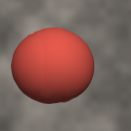

# B1 — the FG's first row against exact truth

> **DEFAULT CHANGE, 2026-09-11 — every number below predates it.** `single_track`'s screen-static ramp
> shipped as `smoothstep(1.2, 3.0, ...)` when these rows were measured; it now ships as
> `smoothstep(1.0, 1.6, ...)` (`hold_lo` / `hold_hi`, P-042 in `docs/LEARNING_LOG.md`). Under the new
> default the same corpora score BETTER on hallucinated mass everywhere (-8 % to -54 %), better on the
> spinning box's position at 6.7 and 13.4 px/pair (-15 %, -25 %), and WORSE on the sphere's position at
> 6.7 px/pair (+11 %). **To reproduce a row on this page exactly, pass `--st-hold-lo 1.2 --st-hold-hi 3.0`.**
> These rows are not re-measured: re-running the twelve-corpus record is its own job.

**Date:** 2026-09-08 · **Tools:** `tools/scene_truth/` (renderer `scene_zoo.py`, scorer `scene_report.py`,
bridge `scene_live.ps1` + `scene_align.py`, stepper `scene_step.py`, review `scene_review.py`)
**Binary:** `build-release/phyriad_fg.exe` at `f2e4a9a`, default kernel, `--fg-factor 4`, `--qdump`
(sync present path, sampled ticks). **Corpus:** `mixed` scene, 640×360, base 240 fps, 1 s, seed 7,
barcoded; the FG was shown `source_k4/` (every 4th base frame, 60 fps) in `play_frames.ps1`'s window,
looped.

---

## 1. What this is, and what it is not

It is the first time a frame the shipping FG generated has been scored against a truth that is
**exact at the FG's own phase** — the scene is a closed-form function of time, rendered at
`t = tA + t_fg·(tB − tA)` for each generated frame, with per-pixel labels (object id, and whether a
real frame ever showed that pixel). The FG's phases sat a mean **0.487 base frames** from the nearest
base frame, so scoring against stored frames would have charged it half a frame of motion that was
the alignment's; the truth was rendered on demand instead.

It is **not** the shipping path: `--qdump` forces the sync present and **samples** (8 phase bins,
≥ 8 ticks apart) — 351 triples in 20 s, 136 unique after the 1 s loop repeated pairs, **133 scored**
after one cut pair was excluded (§4). **DI-3 is satisfied for both the synthetic curve (§3) and the
FG row itself (§2b):** a second live run on a corpus of a different seed, same protocol, agrees on
every citable term within 13 %.

## 2. The row (k = 4, 133 frames, exact phase, cut pairs excluded)

| arm | pos_err px | shape_err px | halluc px² | lead px | missing px² | bg_err | sharp | disocc (apart) | verdict |
|---|---|---|---|---|---|---|---|---|---|
| `truth` | 0.000 | 0.000 | 0 | +0.00 | 0 | 0.0000 | 1.000 | 0.0000 | ACCEPT |
| `nearest` | 0.275 | 0.140 | 57 | −12.76 | 29 | 0.0001 | 0.934 | 0.0670 | pos |
| `oracle2` | 0.097 | 0.156 | 27 | −23.03 | 56 | 0.0001 | 1.000 | 0.0670 | ACCEPT |
| **`fg`** | **0.216** | 0.145 | 52 | **+8.55** | 25 | 0.0008 | 0.955 | 0.0411 | ACCEPT |

Read against the two rulers: on position the FG **beats showing the nearest real frame** (0.216 vs
0.275) and sits **2.2× the exact-flow oracle** (0.097). Its hallucinated mass is the nearest frame's
(52 vs 57) but with the **opposite sign**: the spurious mass *leads* the motion (+8.6 px along it)
where the nearest frame's *trails* (−12.8). Sharpness 0.955, minimum 0.907 over all frames — no blur
anywhere; the veto never fires. The disocclusion bucket (0.0411) is *lower* than the oracle's: where
no real frame saw the pixel, the FG's fill is closer to truth than a bidirectional exact warp's —
reported apart, as designed.

**The verdict is a threshold pass, not a comfortable one.** It is per object, and the sphere's
0.481 px sits under the 0.5 px tolerance by 0.019. The tolerance is this instrument's policy; the
number is the finding.

**Per object, which is where the row actually lives:**

| object | motion | pos_err | shape | halluc | lead | missing |
|---|---|---|---|---|---|---|
| 1 sphere, translating | 3.36 px/pair | **0.481** | 0.292 | 76 | +48.4 | 59 |
| 2 occluder quad, static | 0.00 | 0.009 | 0.009 | 6 | 0 | 0 |
| 3 box, spinning | 1.61 px/pair | 0.159 | 0.135 | 76 | −22.8 | 17 |

The static object is reproduced essentially exactly (0.009 px). The error is on the fastest mover.

**And on the fastest mover it falls with phase:**

| phase φ | sphere pos_err | n |
|---|---|---|
| < 0.25 | **0.668** | 20 |
| 0.25 – 0.75 | 0.490 | 93 |
| > 0.75 | **0.252** | 20 |

This is the signature `records/M1_LOWPHASE_FINDING.md` measured on 2026-09-04 with a different
instrument on a different corpus — the single-track default's *"t = 0+ pays the full backward warp"*,
there 1.67 px → 0.37 px across phase, attributed to the MV consensus pass. An independent renderer,
scorer and corpus reproduce its shape. That is the strongest validation this tool has: it did not
know the finding, and found it.

## 2b. DI-3 — the same row on a second seed

Second corpus: `mixed`, seed 11 (a different backdrop texture and object placement noise), same
binary, same protocol (looped, `--qdump`, k = 4), 342 triples, 132 aligned, 3 cut pairs excluded,
**128 scored**. Full table: `B1_FG_k4_seed11.md`.

| term (fg) | seed 7 | seed 11 | dev |
|---|---|---|---|
| pos_err px | 0.216 | 0.212 | 2.2 % |
| shape_err px | 0.145 | 0.137 | 5.9 % |
| halluc px² | 52.3 | 51.2 | 2.1 % |
| lead px | +8.55 | +8.82 | 3.1 % |
| missing px² | 25.3 | 23.2 | 8.9 % |
| sharp | 0.955 | 0.948 | 0.7 % |
| sphere pos | 0.481 | 0.468 | 2.6 % |
| box pos | 0.159 | 0.160 | 0.1 % |
| sphere, φ < 0.25 | 0.668 | 0.653 | 2.2 % |
| sphere, φ 0.25–0.75 | 0.490 | 0.507 | 3.5 % |
| sphere, φ > 0.75 | 0.252 | 0.221 | 13.1 % |

Worst discrepancy on the citable terms **13.1 %**, on the smallest bucket (20 frames a side); every
term is under the 20 % threshold and may be cited. The rulers move with the seed exactly as little:
`nearest` 0.275 → 0.279, `oracle2` 0.097 → 0.102. The verdict is ACCEPT on both seeds, and on both
it is the sphere's threshold pass (0.481 / 0.468 against 0.5).

**So the row is a result:** at k = 4 from a 60 fps source, the shipping default places a
3.4 px/pair translating object **0.47 ± 0.01 px** from where it belongs, beating the nearest real
frame (0.67) and sitting 3.2× the exact-flow oracle (0.15) on that object; a static object is exact
(0.009); no blur; the spurious mass leads the motion; and the error falls with phase by a factor of
~2.7 from φ < 0.25 to φ > 0.75.

## 3. The curve it sits on (synthetic arms, DI-3 satisfied)

Two corpora, seeds 7 and 11. `nearest`, `blend`, `oracle2` agree between seeds within **0.0–10.9 %**
on every term at every k; `blur` disagrees by 41 % on *position* (0.17 vs 0.27 px — a blurred
silhouette's crossing depends on the local backdrop texture) while its BLUR flag holds at 1.5 %, so
its position carries no verdict and its sharpness does. Full tables: `B1_SWEEP_seed7.md`,
`B1_SWEEP_seed11.md`.

| k | displacement/pair | `nearest` pos | `blend` pos · halluc | `oracle2` pos | note |
|---|---|---|---|---|---|
| 2 | ~0.85 px | 0.217 | 0.052 · 46 | 0.081 | **blend ACCEPTED** — the gate's floor is ~1 px/pair |
| 4 | ~1.7 px | 0.275 | 0.245 · 123 | 0.097 | blend: BLUR / halluc / pos |
| 8 | ~3.4 px | 0.571 | 0.590 · 286 | 0.107 | nearest and blend fail everything |
| 16 | ~6.8 px | 1.105 | 1.260 · 622 | 0.116 | oracle2 still ACCEPT |

The oracle is flat in k (0.08 → 0.12 px): that is the ceiling of a warp with a perfect flow. The
`blend` acceptance at k = 2 is a limit of the instrument, stated: below ~1 px of displacement per
pair the ghost fringe is inside the perimeter tolerance and sharpness stays above 0.90.

## 4. The frame that was almost recorded as a hallucination

The first scoring of this run carried one frame with **2,865 px² of hallucinated mass** on the sphere
— a doubled sphere with a seam, sharpness 0.515, the run's worst by a factor of ten — and a draft of
this record named it the first hallucination event. Its own numbers said otherwise: a displacement
per pair of **197.7 px** for an object that moves 3.4. The aligner had flagged it — one of the pairs
whose two real frames were *not* four apart — and it was the **loop seam**: the player restarted the
1 s sequence, the FG saw base frame 236 followed by base frame 0, the sphere jumping from one side of
the view to the other, and interpolated between them.

 

That doubled sphere is the honest output for a **cut**: there is no interpolation truth for it. Two
things follow, both done. The scorer now **counts and excludes** any live frame whose real pair is
not k apart (it removed one frame here; the row above is the 133 that remain). And the finding it
*does* carry is not about interpolation: the FG has **no scene-cut detector** (the coverage audit
confirmed it), and this is what its absence looks like — a double image where the right answer is the
real frame. It was inflating the high-phase mean: with it, φ > 0.75 read 1.25 px; without it, 0.25.

## 5. What is owed before any of this is a result

- The FG's own curve: k = 2 and k = 8 live, read against the oracle's flatness.
- Provenance on the worst *genuine* frames (now #54 φ 0.38, 270 px²; #61, #93, #117 at φ ≈ 0.13):
  `ref_warp.py --decisions` on their qdump triples.
- The file backend (B2): every tick, the async path, no sampler.

---

**Addendum 2026-09-10 (P-028).** The raw `qdump_k4/` of `sc_live` — the sampler capture behind the k = 4
row above, 351 triples with their prev/next/live/mv planes — was deleted by a session tool defect (a
`-DryRun` of `scene_live.ps1` that removed the directory before exiting). `arms/fg_k4/` (the 136 aligned
generated frames) and `fg_k4.json` / `fg_k4.md` (the scored rows) survive, so every number in this
record stands and the stepper still walks the run; what is no longer reproducible from this run is the
per-pixel provenance replay of `B1_SPEED_TEST.md` §4 (its four worst frames were read from that capture)
and the scoring of its cut triples. `sc_live2`, `sc_v05`, `sc_v2`, `sc_v4` and `g5_live` keep their raw
captures. A re-capture of `sc_live` at k = 4 is a new sample, not a restoration.

*Made with my soul - Swately <3*
